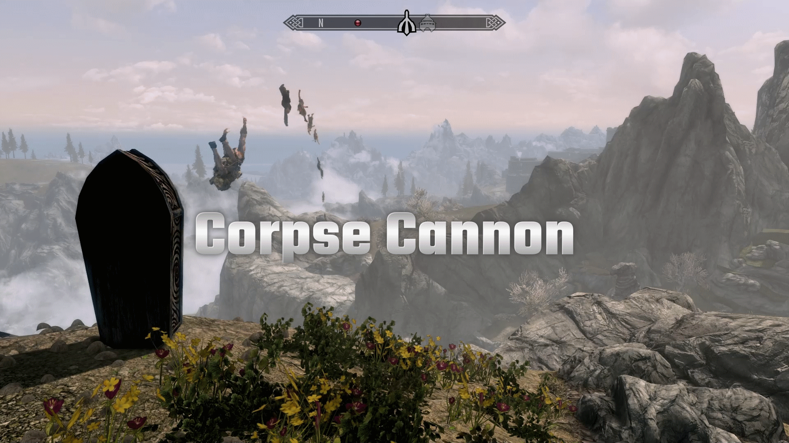

# Corpse Cannon

A Skyrim Special Edition mod By Mark E. Kraus.

My mods:

* [Barstool Brawler](https://www.nexusmods.com/skyrimspecialedition/mods/61354)
* [Chairhammers - Chair Warhammers](https://www.nexusmods.com/skyrimspecialedition/mods/61304)
* [Chairrows - Chair Arrows](https://www.nexusmods.com/skyrimspecialedition/mods/61168)
* [Cheat Jewelry](https://www.nexusmods.com/skyrimspecialedition/mods/58973)
* [Cheat Powers](https://www.nexusmods.com/skyrimspecialedition/mods/58892)
* [Corpse Cannon]({NEWURL})
* [Exit Combat Power](https://www.nexusmods.com/skyrimspecialedition/mods/58651)
* [Greatchairs - Chair Greatswords](https://www.nexusmods.com/skyrimspecialedition/mods/62526)
* [Sentient Chairs of Skyrim (SCOS)](https://www.nexusmods.com/skyrimspecialedition/mods/59604)
* [Summon Corpses](https://www.nexusmods.com/skyrimspecialedition/mods/62857)

## About Corpse Cannon

Adds a power that summons a coffin once a day to shoot 1 to 25 fresh corpses from the targeted area. The number of corpses is based on your Conjuration skill and can be configured in the Mod Configuration Menu.

Why would someone need a Corpse Cannon? I don't know. It's not my place to judge or ask questions.

## Features

### The Corpse Cannon

The "Corpse Cannon" power can be used once a day. It will summon a coffin at the targeted area and shoot 1-25 corpses. The power can be learned through a spell tome in the Whiterun Hall of the Dead Catacombs. The corpses can be looted, reanimated, or just left for decoration. The summoned corpses are not persistent so they will de-spawn like most hostile NPCs.

The Corpses will not harm yourself or other NPCs if you or they are in the line of fire.

### Corpse Ammo Count

The amount of corpse ammo scales with your Conjuration skill. The maximum amount of corpse ammo can be set in the Mod Configuration Menu (MCM). Consider toggling this down if you suffer performance issues with the default setting.

Max 1: Only 1 corpse will be spawned regardless of skill level.

Max 5:

* Skill level 1-29: 1 corpse
* Skill level 30-39: 2 corpses
* Skill level 40-49: 3 corpses
* Skill level 50-59: 4 corpses
* Skill level 60+: 5 corpses

Max 10:

* Skill level 1-19: 1 corpse
* Skill level 20-29: 2 corpses
* Skill level 30-39: 4 corpses
* Skill level 40-49: 6 corpses
* Skill level 50-59: 8 corpses
* Skill level 60+: 10 corpses

Max 15:

* Skill level 1-19: 1 corpse
* Skill level 20-29: 3 corpses
* Skill level 30-39: 5 corpses
* Skill level 40-49: 7 corpses
* Skill level 50-59: 10 corpses
* Skill level 60+: 15 corpses

Max 20:

* Skill level 1-19: 1 corpse
* Skill level 20-29: 5 corpses
* Skill level 30-39: 8 corpses
* Skill level 40-49: 10 corpses
* Skill level 50-59: 15 corpses
* Skill level 60+: 20 corpses

Max 25 (Default):

* Skill level 1-19: 1 corpse
* Skill level 20-29: 5 corpses
* Skill level 30-39: 10 corpses
* Skill level 40-49: 15 corpses
* Skill level 50-59: 20 corpses
* Skill level 60+: 25 corpses

### Types of Corpse Ammo

The types of corpses ammo shot are random but can be bandits, warlocks, Forsworn, Guards, Imperial soldiers, Stormcloak soldiers, Thalmor, and vampires.

The level of corpse ammo scales with your player level.

## Troubleshooting Crashes

Hours of testing have proven that the Corpse Cannon can cause Crash-to-Desktops (CTDs). This is because actions are being performed on the NPC too quickly. Depending on a bunch of factors including your hardware, where you are at in the game, how many NPCs are loaded, etc, you may experience a CTD when using the Corpse Cannon.

To fix this, you can use the MCM to adjust the amount of force applied, and the delays between actions. Increasing the delays is the best way to prevent CTDs. Decreasing the force may also help, but the delays seem to be more reliable.

* Open the MCM for Copse Cannon in your Mod Settings
* (optional) Decrease "Cannon Force"
* Increase "Corpse Fire Delay" and/or "Corpse Kill Delay"
* Accept the changes
* Save your game
* Test Corpse Cannon to see if CTDs continue

The downside to increasing the delays is that the Corpse Cannon will fire slower. If you are brave and using really good hardware, you can try decreasing these and see if your game crashes.

## Installation

### Requirements

This mod requires [SkyUI](https://www.nexusmods.com/skyrimspecialedition/mods/12604) for the Mod Configuration Menu.

### NMM/Vortex/MO2

Download and install with Vortex and the FOMOD installer will take care of the rest.

### Manual

* Extract the Zip file.
* Copy the extracted `MarkekrausCorpseCannon.esp` and `MarkekrausCorpseCannon.bsa` files to the `data` folder under your Skyrim: Special Edition installation folder.
* Enable the plugin using whatever method you usually use.

### Load Order

This mod can be installed in any order.

## User Guide

Enter the Whiterun Hall of the Dead Catacombs and read the "Spell Tome: Corpse Cannon" book. Equip the power in your Magick menu. Aim at the location you wish to have corpses fired from. Activate the power. Wait 1 in-game day to use the power again.

You can change the maximum amount of corpse ammo and scaling with Conjuration in the Mod Configuration menu.

## Compatibility

This mod should be compatible with everything. Any mod that significantly modifies the Hall of the Dead Catacombs in Whiterun may make the spell tome inaccessible.
